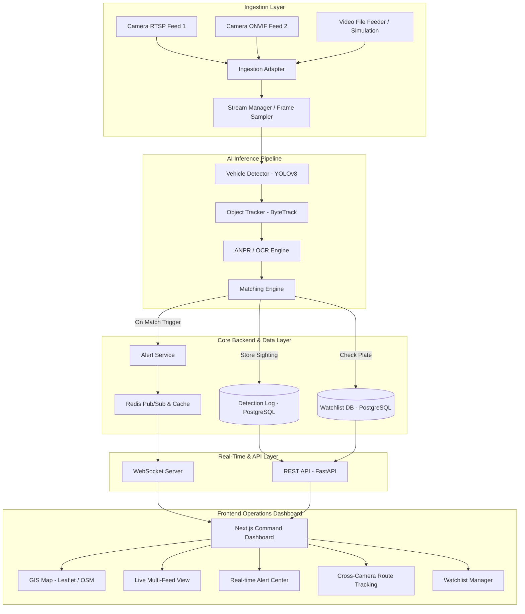

# SentinelGrid — High-Level Design (HLD) & Architecture

## System Architecture Diagram

## Module Responsibilities

1. **Ingestion Adapter**: Normalizes heterogeneous video streams (RTSP, ONVIF, MP4 simulation) into unified frame queues.
2. **AI Inference Pipeline**:
   - Vehicle detection with bounding box coordinates (`YOLOv8`).
   - Intra-camera persistent tracking (`ByteTrack`).
   - License plate localization and text recognition (`PaddleOCR / EasyOCR`).
3. **Matching Engine**: Fuzzy and exact license plate matching against the active watchlist database.
4. **Alert Service & Redis Pub/Sub**: Real-time event broadcasting to subscribed control room clients.
5. **FastAPI Backend**: Provides CRUD APIs for cameras, watchlists, detection events, alerts, and system analytics.
6. **Next.js Dashboard**: Mission-control UI with interactive GIS mapping, dynamic alert triage, video playback, and cross-camera route tracing.
